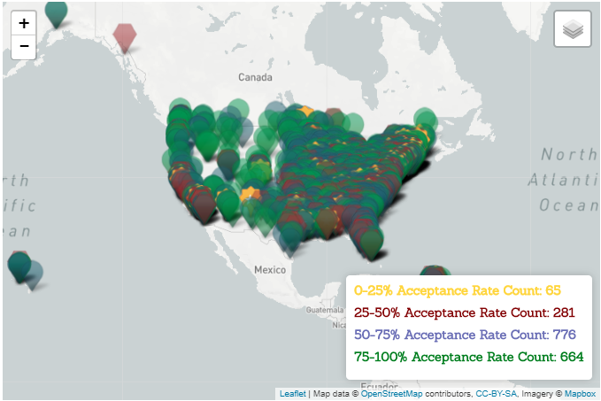
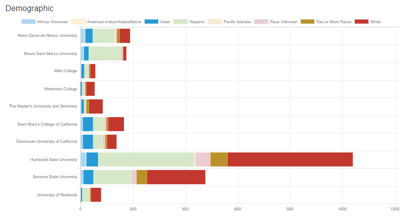
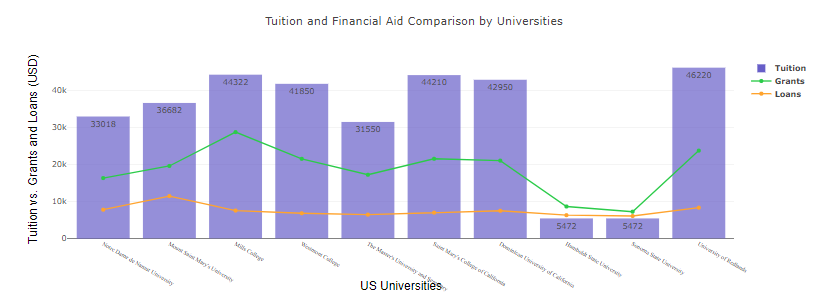
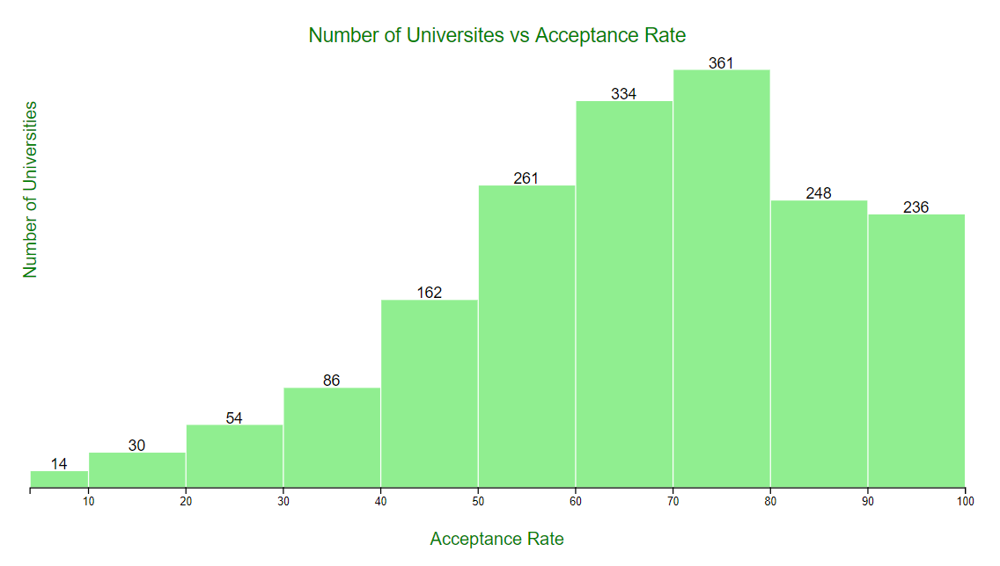

# Colleges and Universities - Which is the right place?

  

With so many good colleges and universities out there, which is the best fit for you and your student?  There are many criteria to look at such as tuition in-state and out-of-state, acceptance rate, location, financial aid, etc.  With this project, we will explore some of these factors to help with reaching an intelligent decision.

For some of us, this topic will be researched and explored further in the near future!

## Project Team:
* Rupali Shah
* Sara Rouzbehani
* Debbie Chan

## Datasets - for Academic Year 2015 - 2016 within the United States

*  [NCES National Center for Education Statistics](https://nces.ed.gov/ipeds/use-the-data)

* [College Scorecard Data](http://api.data.gov/ed/collegescorecard/) was not used since data was pulled from NCES site also.

Data on the NCES site was downloaded as a csv file with final dataset loaded into SQLite.

### Visualizations

#### Interactive map of all universities within the United States and Puerto Rico by acceptance rate created using Leaflet.

The map shows all the undergraduate colleges and universities available in the US and Puerto Rico as of academic year 2015-2016. As an overview, the right side of the US is heavily concentrated with colleges and universities.  There is a breakdown of 25% increments with acceptance rate shown in each of the four layers.  This can be controlled with the map control panel to focus in on one of the acceptance brackets as well as zooming into an area of interest.

  

---
#### Interactive stacked bar chart based on filtered data by state and major field created using chart.js.

  

---
#### Interactive combination chart of bar and lines to compare tuition and financial aid by universities  based on filtered data by state and major field created using plotly.js.

This visualization was created to show the cost of tuition and the average amount that can be possibly covered with grants and loans.  Cost is normally one of the determining factors in choosing a university.  With a shorter list, cost and financial aid comparison would be helpful in narrowing down the list of candidates even more.

  

---

#### Grouping of all universities by acceptance rate using d3.js
The histogram chart shows how many universities are available to students based on the level of difficulty to get admitted. Universities with an acceptance rate of 40% or lower represent 10% of the total number of universities.  80% of the universities, which is almost 1500 universities, have an acceptance rate of 1 in 2.

  

---

### Built With

* Database - SQLite
* Visualizations - D3, Leaflet, chart.js, plotly.js
* Framework - Flask

### GitHub respository

https://github.com/debbiechanca/university_selector.git
