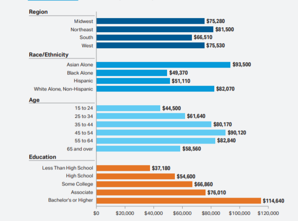

# Colleges and Universities - Which is the right place?

  

With so many good colleges and universities out there, which is the best fit for you and your student?  There are many criteria to look at such as tuition in-state and out-of-state, acceptance rate, graduation rate, location, financial aid, etc.  With this project, we will explore some of these factors to help with reaching an intelligent decision.

For some of us, this topic will be researched and explored further in the near future!

## Project Team:
* Rupali Shah
* Sara Rous
* Debbie Chan

## Datasets - for Academic Year 2015 - 2016 within the United States

*  [NCES National Center for Education Statistics](https://nces.ed.gov/ipeds/use-the-data)
* [College Scorecard Data](http://api.data.gov/ed/collegescorecard/)

Data on the NCES site can be downloaded as a csv file or MS Access database.  For our purposes, we will download csv files and load final dataset into SQLite which will then be converted to geoJSON using [MyGeodata Converter](https://mygeodata.cloud/converter/sqlite-to-geojson).

### "Inspiring" Visualizations

#### Interactive Geographic Visualization of Higher Education

  

---
Following three visualizations are sample visualization to be used with our dataset.

  

---

  

---

  

## Sketch of final design

### GitHub respository

https://github.com/debbiechanca/university_selector.git
